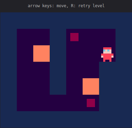

# Px

Px is a tiny 2D canvas framework for turn-based puzzle games.



## Features
- Collision checking
- Keyboard/Mouse events
- Level serialization
- Tiny (~1.9kb gzipped and minified)

## Getting Started

Include px.js in your html file.

```html
<script src="px.js"></script>
```
Create some entity templates. These are the *'objects'* you can spawn in the level grid.

A player:

```js
px.create('player', function (x, y) {
  this.x = x;
  this.y = y;
  this.color = 'pink';

  this.keypress = function (e) {
    if (e.key === 'ArrowRight') {
      px.move(this, this.x + 1, this.y);
    }
    // TODO: Check for other keys...
  }

  this.collide = function (entity) {
    // The player can't go through walls!
    return entity !== 'wall';
  }
});
```

A wall:
```js
px.create('wall', function (x, y) {
  this.x = x;
  this.y = y;
  this.color = '#CCC';
});
```

Initialize your game.

```js
window.onload = function () {
  px.init(5, 5, 48);
  // You can also spawn entities using the level editor
  // by clicking to create entities.
  px.spawn('player', 1, 2);
  px.spawn('wall', 3, 2);
  px.draw();
};
```

---

[A complete game example](./example)